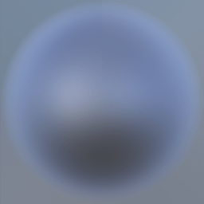

HTML5 UberShader for Kiwi.JS
============================

* Name: Uber Shader Plugin.
* Version: 1.0.0
* Type: Shader
* Author: Benjamin D. Richards for Kiwi.js Team
* Website: www.kiwijs.org
* Kiwi.js Version Last Tested: 1.1.1

----------------------------------------------------------------------------------------
Versions:
----------------------------------------------------------------------------------------

1.0.0
- Initial release: 5 lights, reflection and irradiance maps, gamma, sphere deviation.


----------------------------------------------------------------------------------------
Files/Folders:
----------------------------------------------------------------------------------------
* README.md 	 - This readme file.
* readme.html    - HTML version of this readme file.
* docs/ 		 - API documentation.
* examples/ 	 - Examples of the plugin in action. 
* src/		 - The source files for the plugin. 
* libs/		 - External Libraries that this plugin requires.
* assets/      - Diagrams for this readme.


----------------------------------------------------------------------------------------
Description:
----------------------------------------------------------------------------------------

Thank you for downloading the UberShader for [Kiwi.JS](http://www.kiwijs.org/). This shader is designed to simulate lifelike lighting effects on 2D sprites, allowing you to create unprecedented detail and quality in your Kiwi.JS games.


## Features

### Texture Map Types

The UberShader uses seven texture maps: five to describe the surface of an object, and two to describe local lighting conditions.

* Diffuse: Flat color before lighting.
* Normal: Surface contour information, used to create detailed lighting.
* Specular: Surface reflectivity, controlling color and intensity of highlights.
* Emit: Surface glow information.
* Tint: Each entity can have up to three custom color channels to differentiate diffuse and specular color.
* Irradiance: Sphere map of local light, sampled over a hemisphere.
* Reflection: Sphere map of local light, sampled cleanly.

### Point Lights

The UberShader supports 5 colored point lights with 3D coordinates and custom falloff. These can add detail to the overall light described by irradiance and reflections.

### Gamma Correction

The UberShader can perform gamma correction on its output. By default this is set to 1.2, slightly darkening shadows and emphasising highlights.

### Sphere Deviation

The Ubershader can distort image-based lighting and reflections from sphere maps. This creates an illusion of proximity in the reflections.


----------------------------------------------------------------------------------------
How to Use: 
----------------------------------------------------------------------------------------

This section contains information necessary to set up the UberShader plugin in your game.

### Installing the Plugin

This plugin is intended for use with [Kiwi.JS](http://www.kiwijs.org/). To add UberShader functionality to your Kiwi.JS game, simply include the plugin file, either `UberShader-1.0.0.js` or `UberShader-1.0.0.min.js`, after including the Kiwi.JS library. You will also need to include the MultiTexture plugin `MultiTexture-1.0.0.js`. We recommend placing all plugins inside a `plugins` folder:

```
<script src="kiwi.js"></script>
<script src="plugins/UberShader-1.0.0.js"></script>
<script src="plugins/MultiTexture-1.0.0.js"></script>
```

### Invoking the Uber Shader

To apply the UberShader to an object, you must follow three steps.

First, create a MultiTexture containing all the texture maps. Load your images individually, either as single images or as sprite sheets, then collate them into a MultiTexture. We recommend you do this in `State.create`. Make sure to list the images in the correct order:

* Diffuse
* Normal
* Specular
* Emit
* Tint
* Irradiance
* Reflection

The MultiTextureAtlas is constructed thus:

`Kiwi.Textures.MultiTextureAtlas( name, imageType, cells, textureArray, sequences )`

	`name` (String): The identifier of the atlas.
	`imageType` (Number): The image type, either Kiwi.Textures.MultiTextureAtlas.SINGLE_IMAGE, Kiwi.Textures.MultiTextureAtlas.SPRITE_SHEET, or Kiwi.Textures.MultiTextureAtlas.TEXTURE_ATLAS. Treat this as a hint for the purpose of the MultiTextureAtlas.
	`cells` (Array): The cell data for the MultiTextureAtlas. This is most easily copied from one of the source images.
	`textureArray` (Array): An array of images to form the MultiTexture.
	`sequences` (Array): An array of animation sequences. You may safely define this as `null`.

Example:

```
// Load the myXXX assets during preload
//...

// During create:

var multiTextures = [
	this.textures.myDiff.image,
	this.textures.myNorm.image,
	this.textures.mySpec.image,
	this.textures.myEmit.image,
	this.textures.myTint.image,
	this.textures.myIrradianceMap.image,
	this.textures.myReflectionMap.image
];
var myMTA = new Kiwi.Textures.MultiTextureAtlas("myMTA", Kiwi.Textures.MultiTextureAtlas.SINGLE_IMAGE, this.textures.myDiff.cells, multiTextures, null);
this.textureLibrary.add( myMTA );
```

Second, you must create your object using the MultiTextureAtlas. It is easiest to assign the object `atlas` a single texture, such as the diffuse map, then reassign the MultiTextureAtlas. This will ensure the game object has all its information properly filled out:

```
// where "this" is the current state
var myEntity = new Kiwi.GameObjects.Sprite( this, this.textures.myDiff, 0, 0 );
myEntity.atlas = myMTA;
```

Third, you must assign the UberShader renderer to your game entity, and configure some additional information. The UberShader renderer does not require, but works better with, a link to the Game object.

```
// where "this" is the current state

var uberShaderRenderer = this.game.renderer.requestSharedRenderer( "UberShaderRenderer" );

myEntity.glRenderer = uberShaderRenderer;

uberShaderRenderer.game = this.game;
```

### Setting Up Lights

You can configure lights on the UberShader renderer. These will apply to every object that uses that renderer.

There are 5 lights available, stored as the `uberShaderRenderer.lights` array. Each element in this array is an object with the following properties:

	* `lightVector`: The position of the light, relative to the screen.
	* `lightColor`: RGB values in the range 0-1.
	* `lightIntensity`: The distance at which the light reaches normal strength, measured in pixels; usually in the range 100-500.
	* `lightFalloff`: The rate at which light falls off. The default value is 2, which represents falloff with the square of the distance as in nature. You may give it any value, but will probably only be interested in 1 or 0.

By default, these lights are colored white ( [1,1,1] ) and have intensity 0. Any lights you do not wish to use can be set to 0.

### Optional Per Entity Parameters

You may specify optional parameters directly on entities using the UberShader. These allow you to customise the emit and tint qualities of the shader on a per-object basis.

To control the brightness of emission, add the `uberEmit` property to a game entity. Set it in the range 0-1.

```
myEntity.uberEmit = 1.0;
```

To control the color of tint masks, add an `uberTints` object to a game entity, and populate it with `tint1`, `tint2` and `tint3`. Each tint is a color defined as an array of 4 values in the range 0-1. The first three values are RGB. The last value defines whether the tint also applies to specular color; a value of 0 does not affect specular color, while a value of 1 creates metallic reflections.

```
myEntity.uberTints = {
    tint1: [1.0, 0.0, 0.0,  0.0],
    tint2: [0.0, 1.0, 0.0,  0.0],
    tint3: [0.0, 0.0, 1.0,  0.0]
};
```

### Reusing the Uber Shader

Once you have initialised the UberShader, you may assign it to other objects, so long as they have a valid MultiTextureAtlas:

```
var myEntity2 = new Kiwi.GameObjects.Sprite( this, this.textures.myMTA, 0, 0 );
myEntity2.glRenderer = uberTextureRenderer;
// OR
myEntity2.glRenderer = this.game.renderer.requestSharedRenderer( "UberShaderRenderer" );
```

Because this refers to the same renderer, you do not need to reconfigure the lights or relink it to the Game object.

You may also use the standard Kiwi.JS renderer cloning techniques to create another renderer, but you will need to link the new clone to the Game object and provide unique lighting information.

### Customising the Uber Shader

The UberShader works very efficiently, but it has to do a lot of work to create high-quality renders. If you are not using every feature of the shader, you can see substantial performance upgrades by disabling unused features. Please contact us via the [Kiwi.JS website](http://www.kiwijs.org/) to discuss creating a custom performance build.

### Questions and Answers

* **Can I use a sprite sheet with the UberShader?** Yes. Simply make sure you set up the sprite cell data correctly on the asset you use for the MultiTextureAtlas' `cells` parameter. It will be applied to all the textures.
* **Can I use different image sizes for different texture maps?** Yes, but they must be of the same proportion and layout. The shader will use proportional cells, treating each image as though it were stretched to match the "base image" you provided for the texture atlas cells in the MultiTextureAtlas. It will not respect texture atlas cells defined on other textures.
* **Can I animate the irradiance or reflection maps?** No. The shader achieves high performance by relying on fixed coordinates for sphere maps. Adding the extra calculations to support multiple atlas cells would be too complex. If you wish to animate a sphere map, you will have to do it as a canvas draw operation. Consult `Kiwi.GameObjects.TextField` to see how we deal with real-time draw operations, in particular tagging textures as "dirty" so they may be updated on the video card.


----------------------------------------------------------------------------------------
Tips for Power Users: Artists and Coders:
----------------------------------------------------------------------------------------

This section describes advanced functionality. The UberShader makes use of several hidden data channels. It is also able to implement some very sophisticated shading techniques for free, if you know how to take advantage of them.

For starters, remember that this is not a 3D shader. It draws sprites. You are always guaranteed to have a fixed view angle. This simplifies a great many calculations, allowing you to bake them into a texture map before the program even begins to run.

### Working with Alpha Channels

Several abilities of the UberShader depend on correctly-formatted alpha channels. We prefer to use PNG files, as they are relatively small and support proper transparency. Adobe Photoshop does not offer sufficient control to properly save some of the more subtle alpha tricks in PNG format. We recommend using the [SuperPNG](http://www.fnordware.com/superpng/) plugin to save correct alpha channels. You may also get good results from [The GIMP](http://www.gimp.org/), another image editing system.

### Controlling Point Lights

#### Phong Shading Model

The point lights in the UberShader are computed using the Phong model. This breaks illumination into two parts: diffuse and specular light.

Diffuse light is released by matte surfaces. It doesn't matter what angle the viewer is at, light gets scattered in all directions.

Specular light is released by shiny surfaces. It is very strong when you are observing the reflection of a light source, and falls off rapidly outside that highlight.

Added together, these combine the characteristics of both shiny and matte surfaces for a convincing simulation of real-world light.

#### Z Depth

Although Kiwi.JS does not render in 3D space, the UberShader still computes lights with a Z coordinate. Positive values are "in front of" the screen; negative values are "behind" it. Lights generally look nice when their intensity is roughly equal to their Z coordinate; this prevents excessive light intensity on objects close to the light.


As you can see from this diagram, the difference between Z = 100 and Z = 600 is quite pronounced.

#### Fake Directional Light

While all the lights in the UberShader are point lights for performance reasons, it is possible to create a reasonable facsimile of a directional light. Whereas a point light spreads out and attenuates with distance, a directional light does not: the rays are treated as arriving in parallel from an infinitely distant source.

While we cannot make the rays perfectly parallel, we can certainly eliminate falloff. Simply change the `lightFalloff` parameter of a light on the UberShaderRenderer to 0, preventing any distance-based attenuation. Then move the light several screens away from the viewport. Its rays will appear very nearly parallel, and it will not attenuate over the great distance.

Note that `lightFalloff` of 0 will actually render `lightIntensity` meaningless. The falloff is used as an exponent in the lighting calculation, and anything to the power of 0 will always equal 1. Even setting light to brightness 0 will not turn it off. You must control light brightness by directly setting the RGB value of `lightColor`.

#### Point Lights, Scene Graph, and the Camera

Note that point lights are not part of the scene graph. If you move the State, they will not follow. In addition, you cannot add point lights to Groups. This would be a convenient way to connect a light to an object.

You can solve this problem by setting up a connection between the scene graph and the point lights. Simply create an empty group and position it where you want the light to go. Then, during the `update` loop of the State, set the `lightVector` of the light according to world position. Fortunately, Kiwi.JS provides convenient methods for this. You don't even have to do matrix sorcery.

```
// First create a group...
var group = new Kiwi.Group( this );
// Position it where you want...

// Then, during the update function, set the light position:
uberShaderRenderer.lights[0].lightPosition = [ group.worldX, group.worldY ];
```

Note that lights do respect camera movement (which _is_ sorcery, but we do the dark matrix work behind the scenes). If you are moving the state to represent scrolling, this may cause lighting complications. We recommend moving the camera instead. You can access this transform property at `game.cameras.defaultCamera.transform` (where `game` is your Kiwi.Game object).

#### Limits on Lights

Each light is costly to render, definitely the costliest part of the whole renderer. We've provided 5 lights, but if you don't need that many, consider working with us to deactivate some or all of them. The environment maps can do a lot of that work much more cheaply.

If you would like to use more lights, that's likewise possible. However, you may encounter hardware incompatibility. 5 lights is the maximum that we could get running on our Samsung Galaxy Tab 3. The hardware is somewhat infamous for its poor OpenGL optimisation, so it made a decent baseline.

Why is this a hard limit? It has to do with the way shaders are loaded into hardware. They are compiled at run time, and the way they are compiled depends on the hardware. In the case of the Samsung tablet, the hardware has a maximum instruction count of 512, and it optimises its instructions poorly. The sixth light adds too many instructions, and it fails to run.

If you intend to target more capable hardware platforms, this does not matter. You may be able to get away with many more lights.

### Diffuse Map

The diffuse map is the most basic part of the image. It's just a flat color. However, there is still some subtlety to it.

#### Flat Color

When we say flat color, we mean _flat_. Diffuse maps should not have shading of any kind. Highlights and shadows are not part of the diffuse map.


#### Ambient Occlusion

The sole exception is ambient occlusion. This is a real-life lighting effect. Crevices and concave areas in objects cannot receive light from all directions. We say the _ambient_ light has been occluded, or blocked.


When creating textures for use with the UberShader, you should incorporate ambient occlusion into the diffuse map. This will make it seem more realistic, at no extra rendering cost.

Note that our occlusion render included a ground plane. This creates the illusion of contact shadows where the object touches the ground. Spend some time when creating your spritesheets to preserve this data.


#### Avoid Programmer Colors

A "programmer color" is one which serves a valuable diagnostic purpose, but does not look good in real applications. Bright red (255, 0, 0) is an example of a programmer color.

These are a poor choice for lit scenes and should be avoided wherever possible. Light multiplies each color channel in a surface. But if some of those channels are 0, they will never accumulate light. Multiply that red by a million, and you will still have nothing but red. If instead you choose (229, 23, 23), the green and blue channels will have something to work with, and the color will quickly blow out to white. This feels much more natural to the eye.


#### Diffuse Alpha

The alpha channel of the diffuse map is used, as expected, for transparency information. Note that it is not the master transparency; it only applies to the diffuse color plus any tint values. The specular map has its own alpha channel.

#### Hero Map

Although diffuse maps may look flat without lighting information, they are still the most recognisable of textures. They are loaded first, so that in the event of WebGL failure there is still a human-relatable texture to display.

We recommend you use the diffuse map as a "hero". Make sure it looks good. You can use it as reference for sprite sheets and texture atlas cells. In our use examples above, we use the diffuse pass wherever a multitexture is not suitable as a parameter.

#### Example Diffuse Sprite

This is an example of a diffuse-shaded object. It has zero shininess and no specular highlights. Note how the human hand looks quite realistic with no shininess. This is because it is a naturally matte surface. In reality there is still some reflection due to skin oil and the material of the nails, but we'll get to that later.

[Click here to run the realtime example.](http://files.kiwijs.org/UberShaderExamples/examples/DiffuseHand/index.html) This example is also included in the UberShader repository as `examples/DiffuseHand`.


### Normal Map

A normal map is simply a record of surface contours. The RGB components of the map are converted into XYZ coordinates of a vector orthogonal to the surface. This is extremely useful in light calculations.

#### Normal Conventions and Preprocessing

The UberShader expects normal maps in a certain configuration. RGB maps componentwise to XYZ. Your normal map creating software of choice may not output the channels in the same order. Check to see if it fulfils the following criteria:

* Blue areas are flat.
* Green areas are facing the top.
* Red areas are facing the right.

A well-formed normal map looks like this:


If your normal map does not meet these criteria, it is simple to fix. Either re-render it with the correct settings, or perform some simple operations in Photoshop. While you're unlikely to be creating your own normal maps by hand, you can easily do channel work.

* If green areas are facing the bottom instead of the top, use Curves on the Green channel and invert it.
* If green areas are facing left-right instead of up-down, you'll have to swap some channels. Use the Channel Mixer adjustment, either as an adjustment layer, or under Image -> Adjustments.

If you're feeling brave, you can even paint additional detail into the normal map by hand. Remember that color corresponds to surface angle.

#### Creating Normal Maps from Photos

We used [CrazyBump](http://www.crazybump.com/) to create our hand examples (hand model: Zachary Freiberg). This software costs money, but it produces great results. Other tools exist, such as [Normal Map Online](http://cpetry.github.io/NormalMap-Online/), which can accept a height map and output proper normal maps.

#### Normal Alpha: Specular Exponent

Because normal maps don't care about transparency (it's handled by the diffuse and specular maps), the alpha channel is free. We've decided to use it to control the specular exponent. See Specular Map for more information.

### Specular Map

The specular map controls how shiny and reflective your game object is across its surface. In general, shiny areas should be white, while dull areas should be black. Pits and crevices in a surface should also be darker than their surroundings, as light cannot easily enter their depths.


#### Highlight Color

The color of the highlight is usually taken from the light itself. To obtain this effect, the specular map should be grayscale, with white in shiny areas and black in dark areas.

#### Metallicity

Metallic objects reflect only a portion of light. The highlight takes on the color of the object itself. To obtain this effect, the specular map should be colored. Using a copy of the diffuse map is a good start.


Here is an example of two glossy objects. Both use the exact same diffuse and normal information, but one has a grayscale specular map and the other has a colored specular. Note how this simple difference can imply the difference between plastic and metal.

[Click here to run the realtime example.](http://files.kiwijs.org/UberShaderExamples/examples/SpecularMetalHand/index.html) This example is also included in the UberShader repository as `examples/SpecularMetalHand`.


#### Iridescence

Some objects, such as oil on water, pearlescent paint, or bismuth crystals, have complex microstructures that shine in different colors at different angles. As we view sprites from a fixed angle, we can bake iridescence into the specular map itself.

In general, low-energy photons from the red end of the spectrum are more visible on dead-on surfaces, while blue photons are more visible at greater angles.

You can simulate this by selecting fuzzy bands of the blue channel on the normal map, or by rendering a "facing ratio" pass if your sprites are based on 3D models.

This example exaggerates the effect:


#### Specular Alpha

The alpha channel of the specular map is, as expected, used for transparency information. This is separate from the diffuse transparency because specular light information is directional, and this results in different behaviour.

#### Fresnel Terms

19th century French physicist Augustin-Jean Fresnel analysed the transmission of light between two media, creating the so-called Fresnel Equations. Some light is reflected and bounces off the surface, while other light is refracted into the second medium. The key observation was that the _amount of reflection varies based on angle of incidence_. A ray of light that strikes a surface dead-on will be mostly refracted and have little reflection, while a ray that strikes at a glancing angle will be mostly reflected.

This is useful for glass and water surfaces, but it also applies to translucent substances such as human skin.

Because our sprites are viewed at a fixed angle, we can tell ahead of time what angle of incidence any point on the surface must have. This allows us to bake Fresnel terms into the specular texture itself. Increase the alpha of those parts of a sprite that do not directly face the camera. You can do this either by rendering a "facing ratio" pass if your sprites are based on 3D models, or by using the blue channel of your normal map as a mask (the blue channel represents how dead-on the surface is to the viewer).

Beyond a certain angle, translucent objects become totally reflective. The rim of a transparent object should have a band of specular alpha of 1.

We can also accentuate the high-energy photons at the blue end of the spectrum. Simply use Curves on the blue channel of the specular map in Photoshop.

The result should look something like this (we have rendered it against a black background for clarity):


Like opaque objects, transparent objects can have metallic highlights. In the following example, we render one metallic and one non-metallic object, again varying nothing but the specular map. Note that you can see parts of the background through the central parts of the objects, but not through the more reflective edges. We've enabled environment lighting for these objects, as it helps illustrate the point.

[Click here to run the realtime example.](http://files.kiwijs.org/UberShaderExamples/examples/SpecularGlassHand/index.html) This example is also included in the UberShader repository as `examples/SpecularGlassHand`.


Largely opaque objects such as metals will not internalise light at any angle, and will probably not have noticable Fresnel terms. Sci-fi effects such as cloaking fields and energy shields can do just about anything, so go crazy.

#### Shader Parameter: maxExponent

The _exponent_ of a specular surface dictates how tight the highlight appears. If the exponent is very high, the highlight is very tight. If the exponent is low, the highlight expands. You can control the general tightness of highlights across the entire shader by setting `uberShaderRenderer.maxExponent`. It has a default value of 32.

#### Shader Parameter: specularIntensity

The _intensity_ of the specular surface dictates how bright the highlight appears. You can control this across the entire shader by setting `uberShaderRenderer.specularIntensity`. Under realistic lighting conditions, this defaults to 1. If you turn it up, you will obtain much brighter highlights. This is unrealistic, but can help emphasise super-glossy surfaces.

##### Exponent from Normal Map

In addition, you can control the exponent on a per-pixel basis. This allows you to soften the highlight in some areas by painting the region in darker colors.

Bear in mind that linear color gradients in an exponent channel do not correspond to linear highlight size alterations. This is because of the way exponents work.

Some mathematics: The base exponent, default 32.0, is multiplied by the normalized value of the exponent channel. Imagine that we have a light value of 0.9 before exponent. If the exponent channel is 1.0, the multiplied exponent is 32.0, and the output is 0.9 ^ 32.0 = 0.034. If the exponent channel is 0.5, the multiplied exponent is 16.0, and the output is 0.9 ^ 16.0 = 0.185. Halving the channel value has dilated this part of the highlight _six times_.

There are not enough channels in the specular map to hold this data, so we pack it into the alpha channel of the normal map. These images show an exponent map in grayscale, and a normal map with the alpha channel used for an exponent map, shown against a black background for clarity. In the actual files, the normal would retain all color information. Note how the reflectivity of the fingernails has been accentuated.


You do not need to specify an alpha channel for the normal map. It is perfectly functional without one, and will simply provide default highlight exponents across the scene.

### Emit Map

An emission map is an additional texture that is unaffected by lighting. It is useful for glowing surfaces such as lights, flames, engine ports, or the glow of the atmosphere and sky.

#### Glow Color

Your emit map contains the colours of glowing areas. Any area that does not glow should be painted black. Because it is additive, black areas will not appear in the final image; you do not have to worry about alphas (and, in fact, the alpha channel has another optional function).

#### Sub-Surface Scattering (SSS)

SSS is a phenomenon caused by translucent objects such as jade or skin. When light is absorbed by the surface, it bounces around inside the object and emerges unpredictably around the point of entry. This causes a distinctive soft glow. It is most easily seen when the sun shines through someone's ears, or you hold your fingers over a torch at night.

The UberShader does not perform realtime SSS. However, the emit map can benefit from an understanding of SSS.

In the following emit map, we added a soft red aura to the glowing parts of the image, as though the light were scattering through the skin. This adds greatly to the realism of the glow effect.


#### Entity Parameter: uberEmit

The UberShader allows you to control the brightness of the emit map on a per-object basis. Simply set a parameter called `uberEmit`:

```
myEntity.uberEmit = 1.0;
```

If the shader does not find this parameter, it will default to 0.

The `uberEmit` parameter is in fact not a simple brightness slider, although it does function as one. It represents a half cycle of a cosine wave. If you increase it above 1, the brightness will start to diminish again. You cannot "blow out" the image by brightening it; if you want particularly bright lights, paint them with a white core.

Because the parameter is a cosine wave, it smoothly transitions from 0 to 1. You don't need anything more sophisticated than a linear tween when animating the value.

#### Emit Alpha: Phase and Animate Glow Flow

The alpha channel of an emit map is used to control the phase. This value (where black is 0 and white is 1) is added to the `uberEmit` parameter for each rendered pixel.

If the emit alpha is flat white, the image will behave simply. This will also happen if it is flat black, although you may lose data if you are not careful about saving a totally transparent image.

However, if you introduce gradients into the emit alpha, then start animating the `uberEmit` value, you can get amazing effects. Because the phase varies across the image, different parts will brighten at different times.

This is an emit map with a phase channel:


[Click here to run the realtime example.](http://files.kiwijs.org/UberShaderExamples/examples/EmitHand/index.html) This example is also included in the UberShader repository as `examples/EmitHand`.


Note that if you are using a phased map you can never fully turn it off. Some part will always be active. It is intended for permanent cycling effects.

### Tint Map

The tint map allows you to define custom colors on various areas of your entities. This can greatly augment the visual variety of your scenes.

Kiwi.JS would normally require each unique entity to use its own texture. This would require a great many files and a great many draw calls to the video card. The result is big and slow. By introducing tint maps to the UberShader, we allow the render pipeline to use one texture and one draw call.

#### Three Channels

Each of the RGB channels in the tint map forms a mask. You can define each mask independently; they can overlap or occupy different parts of the object. Black areas are not affected; white areas are fully affected.

Each tint value is set by a property on the game entity. You may set these as follows:

```
myEntity.uberTints = {
    tint1: [1.0, 0.0, 0.0,  0.0],
    tint2: [0.0, 1.0, 0.0,  0.0],
    tint3: [0.0, 0.0, 1.0,  0.0]
};
```

The shader will default to the above values in the absence of other information. In this way you can quickly see what areas are affected by the red, green, and blue channels.

A tint map might look like this:


#### Tint Palettes

You may wish to set tints to randomly-selected terms from a list. For example, when populating a crowd, it may be useful to randomly assign eye colors. This code may help:

```
var eyeColors = [
    [0.52, 0.21, 0.08, 0.0],    // Light brown
    [0.4, 0.21, 0.08, 0.0],     // Dark brown
    [0.4, 0.69, 0.96, 0.0],    // Blue
    [0.46, 0.66, 0.23, 0.0],    // Green
    [0.86, 0.70, 0.95, 0.0],    // Lilac
    [0.91, 0.77, 0.26, 0.0],    // Gold
    [0.96, 0.10, 0.03, 0.0],    // Red
];
for( var i = 0;  i M myEntityList.length;  i++ ) {
	myEntityList[i].uberTints = {
        tint1: eyeColors[ Math.floor(Math.random() * eyeColors.length) ]  // Eyes
        tint2: // You decide what goes here
    }
}
```

#### The Tint Mixer

Inside the shader, the code performs three linear blends:

* From diffuse color to tint1;
* From tint1 to tint2;
* From tint2 to tint3.

There are some hidden gotchas in this system.

For example, imagine you are creating tattoos for a tribe of warriors. Some warriors will not have tattoos; others will. It might seem a good idea to create a palette with two colors: skin and tattoo. However, you must be careful! If your tint channel is at 1.0 in the potential tattoo areas, it will overwrite any detail such as skin texture or the occlusion from wrinkles. It will seem to flatten out the tattoo areas, making them look unnatural.

To reduce these problems, consider using tint channels that only go as high as 0.5 or less, and intensify your tint colors. This will retain some information from the underlying texture, which you can accentuate to look natural in the final blend. You may also want to apply texture derived from the diffuse map to the tint channel.

Another problem arises when you overlap tint masks. Perhaps you also want to vary skin tone of your warriors. You must bear in mind the order of linear blends. In this example, you should probably apply the skin tint first, then the tattoo blend.

#### Specular Tint

By default, the tint does not affect the specular map. This is the function of the fourth term in the tint color array, which we had previously set to 0. This term controls the specular contribution. If you set it to 1, the tint will fully affect the specular channel in the exact same way as it affects the diffuse channel.

As you will probably be using relatively saturated color in the tint channel, you will probably get metallic specular tints. If you want to retain the reflectivity information from the tint area, set the specular contribution low.

In this example, we set nail polish to a range of values. Some are metallic; the black polish, however, would have no highlights if it contributed to the specular map, so it has no contribution.

[Click here to run the realtime example.](http://files.kiwijs.org/UberShaderExamples/examples/TintHand/index.html) This example is also included in the UberShader repository as `examples/TintHand`.


#### Tint Alpha: Reserved

The tint map alpha channel is currently reserved for future functionality. It could potentially add a fourth tint mask. However, when exporting apps to Ludei Cocoon.JS, transparent areas do not report accurate color information. For maximum compatibility, we have elected to disable this channel. If you are creating a project that does not include Cocoon.JS implementation, we can reconfigure the shader to add a fourth channel.

### Reflection Map

This texture is a special map. While it can be assigned to multiple objects in a scene, they should all have the _same_ reflection map. It contains information about the general surroundings, and creates a convincing reflection.

#### Angular/Sphere Map

The reflection is recorded as a sphere map, much like this:


(Map created by Optikz, acquired from [http://blenderartists.org/forum/showthread.php?24038-Free-high-res-skymaps-(Massive-07-update!)](http://blenderartists.org/forum/showthread.php?24038-Free-high-res-skymaps-(Massive-07-update!)))

This is a convenient format for efficient environmental reflections. It is very quick to compute in the shader, based solely on the normal map.

It is **important** to note that, for technical reasons, your sphere maps must have power-of-two resolution. That is, the x and y resolutions must be one of 2, 4, 8, 16, 32, 64, 128, 256, 512, 1024, or 2048. (They need not be the _same_ value, but there's no reason they should be different.) If you do not use power-of-two resolution sphere maps, Kiwi.JS will resize it, the shader will start looking in parts of the image that don't exist, and your objects will develop uexpected black patches.

#### Fixed Perspective

Because Kiwi.JS is a sprite-based system, we assume that the angle of view does not change significantly over time. This simplifies a number of calculations and reduces overhead. Accordingly, there is no facility to shift the perspective of the sphere map. If you wish to shift the angle of view, you'll have to rewrite the sphere map itself. This is a technical exercise left to the reader. Again, consult `Kiwi.GameObjects.TextField` to see how we deal with real-time draw operations, in particular tagging textures as "dirty" so they may be updated on the video card.

#### Light Probe

You can create your own sphere maps very quickly with a camera and a shiny ball. Simply place the ball in your chosen environment, snap a photo, and crop it down so the top, bottom, and sides all touch the image frame. Then resize the image to power-of-two resolution to avoid later errors.

If you do not have a shiny ball, you can use a soup spoon as a passable substitute. It will not return realistic results, but it may be good enough.

You may also get good results by creating a 360 degree panorama and converting it to polar coordinates; see the next section.

#### Polar Coordinates

It is possible to convert to and from a sphere by using polar coordinates. This sounds complicated, but it's really just a case of selecting Filters -> Distort -> Polar Coordinates in both Photoshop and GIMP, and likely other capable editing suites to boot. The filter allows you to convert in both directions, so you can unwrap a sphere map, do some editing in a more familiar viewspace, then wrap it back into a sphere.

You may need to scale the image along one axis after you transform into rectangular coordinates.

Note that every time you do this, you introduce data loss into the image, so try to preserve your steps.


It is also possible to create a sphere map by photographing a traditional panorama, then using polar coordinates on it. The results may not be physically perfect, but they will still look attractive.

#### Reflection Alpha: Unused

We do not currently use the alpha channel in the reflection map. It makes no sense in a reflection, and if the reflection is reused across multiple objects, we can't add object-specific information either.

#### Shader Parameter: sphereDeviation

The one drawback of sphere mapping is the fact that it's not local. The sphere is assumed to be at infinite distance, and so reflections do not shift when objects move without rotating.

The UberShader renderer has a special parameter to increase the apparent curvature of the reflection and irradiance maps. Use `uberShaderRenderer.sphereDeviation` to set this curvature. The default value is 0.05.

The deviation effectively rotates further around the sphere based on the vector from the center of the screen. This is not entirely physically accurate, but it creates the illusion of shifting light as objects move through the scene. In particular, this is useful when you're trying to see reflections on a flat surface. If you had no sphere deviation, all the normals on the surface would point at the same point of the sphere map, and reflect a single color. With deviation enabled, they will spread out a little and reflect a region of the environment.

Try `sphereDeviation` values of 0.2 to 0.5 if you want to see a highly pronounced level of deviation, or a value of 0.0 if you want pure infinite-distance sphere mapping.

This example uses a sphereDeviation of 1.0 to really exaggerate the effect. Note that there are no lights active in the scene; all the highlights are generated by the environment. It is not entirely realistic, but it looks good.

[Click here to run the realtime example.](http://files.kiwijs.org/UberShaderExamples/examples/SphereDeviationHand/index.html) This example is also included in the UberShader repository as `examples/SphereDeviationHand`.

Note that this deviation is computed using screen-space coordinates. Anything that shifts the position on the screen, from sprite animation to camera rotation, will cause the deviation to change. Accordingly, in some cases the highlights may not be identical when viewed at different orientations. This behaviour is eliminated when deviation is reduced to 0.0.

### Irradiance Map

The irradiance map is likewise a sphere map, but it describes matte lighting rather than sharp reflections. The irradiance map is a quick and efficient way to get beautiful real-world lighting into a scene.

#### Irradiant Lighting

A point on the surface of an object scatters light into a hemisphere above it. This light is received most strongly from lights directly above it; lights at an angle are attenuated across a wider surface. Beyond the edges the object itself is preventing light from entering or departing the point.

In other words, matte surfaces transmit light from all around them, not just a single light source. It's like a blurred version of the light from all around the object. The irradiance map models this lighting.



#### Faking Irradiance

You can create an irradiance map with a neutral matte ball, much the same way that you would create a reflection map. However, if you only have a reflection map, you can still create an acceptable irradiance map.

It's not quite as simple as blurring the reflection map. Said map compresses a lot of detail into the very edge, so even a nice Gaussian blur will overblur the rim and introduce distortions.

Instead, you should first convert your reflection map to rectangular coordinates using the Polar Coordinates filter. It will still possess some distortion, but you will be better able to compensate for it in this view. Once you have a reasonably even view, apply a blur. Your blur radius should be about one-quarter the width of the image, such that it incorporates half the view in a simulated hemisphere.

When your blur is complete, convert back to polar coordinates. Now take a copy of the original polar map, and blur that, then mask out the edges and lay it over the top. This will produce reasonably accurate irradiance both around the rim and in the center.

You may need to blur a seam in the resulting polar map.

Your irradiance map will bring new life to your lighting.

[Click here to run the realtime example.](http://files.kiwijs.org/UberShaderExamples/examples/EnvironmentSwitcherHand/index.html) This example is also included in the UberShader repository as `examples/EnvironmentSwitcherHand`.


**Protip**: Because glossy reflections look unnatural on skin, and because we're not rendering anything else, we've blurred the reflection maps slightly. This technique can be extended to other objects in the scene, because reflection and irradiance are defined in texture atlases, not as global shader parameters. You can technically have different reflection and irradiance maps for every object in the scene. In practice this will involve a lot of unnecessary maps and duplicated effort. Know when to use these tools.


----------------------------------------------------------------------------------------
Future Concepts:
----------------------------------------------------------------------------------------

Although an UberShader should be able to do everything, there are always a few things that get cut for time or performance reasons. Here are a few features we'd like to introduce in future versions, of varying levels of realism:

#### Anisotropic Highlights

For that brushed metal look, or realistic hair rendering.

#### Realtime Sub-Surface Scattering

For shiny noses and glowing ears. Really, realtime SSS makes skin come to life.

#### Shadows

We'd like to include self-shadowing and realtime shadows. This is actually a very complicated issue, and we'd probably wind up including parallax shading before it was completed. That would look really cool, though.

#### Global Illumination

High-end graphical solutions probe the environment to determine the color of nearby objects. Light bouncing between surfaces can cause color bleed, and builds up a much more realistic vision of the world.

#### Refraction

Currently, transparent objects cannot refract the background. Future versions of Kiwi.JS will open up that data to manipulation, permitting refraction shaders.

#### Fuzzy Reflection

Right now we only have two levels of environment map: a crisp reflection, and a blurred irradiance map. It would be more realistic to interpolate between the two, allowing for sharp reflections on some parts of an object, and duller gloss on other parts. This is possible using mipmap technology and some clever pre-processing, further accelerating our lightning-fast image-based lighting techniques.